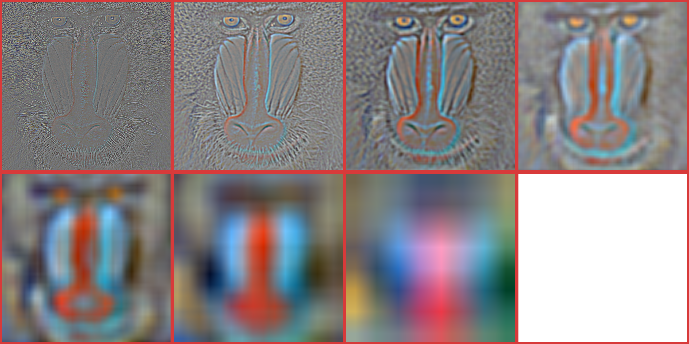

# HDRI Builder
-------------

Project in Python (OpenCV & NumPy)  
**/!\ The list of features exposed bellow is NOT complete, it simply represents the task with the highest priority**  
_Ressources:_ https://app.milanote.com/1JLgty1M5LQ09h?p=gsA2e1Hp2IB

## Basic features of an HDRI builder:
  - Create an HDRI from a set of bracketed pictures
  - Basic noise and (motion)blur reduction
  - Ghosting removal
  - Color correction
  - Tone-mapping
  - Reading & writting files at *.hdr* format
  - Non-destructive twiking of HDRI before saving
  - Fake HDRI "color enhancement" from single picture

**The purpose of this project is to create an HDRI Builder with as uncommon/unexisting features:**

## Global features:
    - Create an animated HDRI from (360-HDRI-canvas + HDR-Videos)
    - Create a HDRI "ready-to-use", that doesn't require previous tone-mapping
    - Generation / usage LUTs

## PC Application:
    - AI boost to create HDRI from a single picture
    - Create a HDRI to .hdr or

## Mobile Application:
    - Create real HDRI images on cellphone
    - Create an HDRI from a video, given a capture protocol
    - Create 360° HDRI without 360° camera
    - Easy transfert from mobile app to PC

-------------

### Current task:
  - [ ] Process influence weight for each pixel of each bracketed image
  - [ ] Process Harris points for future image stitching
  - [x] *Build Laplacian pyramid for RGB images*
  - [x] *Build Gaussian pyramid for RGB images*
  - [x] *Build Gaussian pyramid for single-channel images*

-------------

## Details:

### Weights and Laplacian maps :

>**Weights**  

Creation of an HDRI requires to process a set of values for each image of the set.  
These values will be used as weights, to mix all the differents pixels values in order to form the final image.  
Each weights determines how a pixel is interesting for our HDRI  
The three weights are: the absolute values after a **Laplacian filter** was applied, the **saturation** of each pixel, the **exposure** value of each pixel.  

>**Laplacian pyramid**  

This way to proceed generates visible seams into our output. To get a clean mixing, usage of a Laplacian pyramid is required.
Through the multiple resolutions proposed by each floor of the pyramid, we can achieve a seamless mixing.
To process a Laplacian pyramid, we first need to create a Gaussian pyramid.  
This pyramid is a loop of two steps. To go from *imgn* to *imgn+1* we need to:
  1. Apply a median blur to imgn
  2. Sub-sample by keeping only one pixel from imgn out of two
The Laplacian pyramid is finally generated by doing the difference between each *gaussiann* and *gaussiann+1*
Note that the Laplacian pyramid has one less floor than the Gaussian one. Due to the substraction, the produced channels need to be normalized. Gray values stand for "no change from the one to the other"

