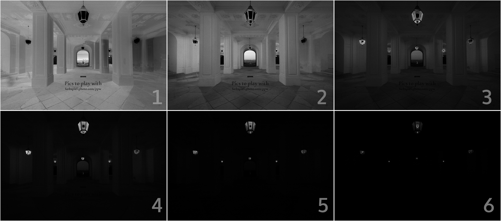

```
██╗  ██╗██████╗ ██████╗ ██╗    ██████╗ ██╗   ██╗██╗██╗     ██████╗ ███████╗██████╗ 
██║  ██║██╔══██╗██╔══██╗██║    ██╔══██╗██║   ██║██║██║     ██╔══██╗██╔════╝██╔══██╗
███████║██║  ██║██████╔╝██║    ██████╔╝██║   ██║██║██║     ██║  ██║█████╗  ██████╔╝
██╔══██║██║  ██║██╔══██╗██║    ██╔══██╗██║   ██║██║██║     ██║  ██║██╔══╝  ██╔══██╗
██║  ██║██████╔╝██║  ██║██║    ██████╔╝╚██████╔╝██║███████╗██████╔╝███████╗██║  ██║
╚═╝  ╚═╝╚═════╝ ╚═╝  ╚═╝╚═╝    ╚═════╝  ╚═════╝ ╚═╝╚══════╝╚═════╝ ╚══════╝╚═╝  ╚═╝
```
  
Project in Python *(Libs: OpenCV, NumPy, CuPy, imutils)*

**!!! The list of features exposed bellow is NOT complete, it simply represents the task with the highest priority !!!**

_Ressources:_ https://app.milanote.com/1JLgty1M5LQ09h?p=gsA2e1Hp2IB

  
  
## 1. Basic features of an HDRI builder:

- [X] Create an HDRI from a set of bracketed pictures

- [ ] Basic noise and (motion) blur reduction

- [ ] Ghosting removal

- [ ] Color correction

- [ ] Tone-mapping

- [ ] Reading & writting files at *.hdr* format

- [ ] Non-destructive twiking of HDRI before saving

- [ ] Fake HDRI "color enhancement" from single picture

  

**The purpose of this project is to create an HDRI Builder with as uncommon/unexisting features:**

  

## 2. Global features:

- [ ] Create an animated HDRI from (360-HDRI-canvas + HDR-Videos)

- [X] Create a HDRI "ready-to-use", that doesn't require previous tone-mapping

- [ ] Generation / usage LUTs

  

### A. PC Application:

- [ ] AI boost to create HDRI from a single picture

- [ ] Create a HDRI (simple or animated patches)

  

### B. Mobile Application:

- [ ] Create real HDRI images on cellphone

- [ ] Create an HDRI from a video, given a capture protocol

- [ ] Create 360° HDRI without 360° camera

- [ ] Easy transfer from mobile app to PC

  

-------------

## 2. Current tasks:

- [ ] Make correct projection of stitched image

- [X] Process influence weight for each pixel of each bracketed image

- [X] Process Harris points for future image stitching

- [x]  *Build Laplacian pyramid for RGB images*

- [x]  *Build Gaussian pyramid for RGB images*

- [x]  *Build Gaussian pyramid for single-channel images*

  

## 3. Implementation of the tone-mapping-less HDRI generator:

### A. Original pictures with bracketed exposure time:  
  

### B. Weight maps :

>**Weights**

Creation of an HDRI requires to process a set of values for each image of the original set. A tuple of three values is attached to each pixel of each input image, to determine how a pixel is interesting. 
A pixel interests us if it is not burnt (too white or black), has a highly saturated color, and represents a detailed area.

These values will be used as weights, to mix our inputs into the final image.

In the following images, a black (0.0) pixel has no importance at all, while a white (1.0) one will widely influence the final result.
A weight map is exactly the same size as the images that we are working on, since they are generated from pixels values.

#### a. Contrast map *(detailed areas)*:
This map is generated by convolution with a Laplacian filter. The shape of this filter highlights edges of objects contained in the image as well as areas with a lot of details.  
Kernel of the Laplacian filter:
<table>  
	<tr>  
		<td>  0  </td>  
		<td>  -1  </td>  
		<td>  0  </td>  
	</tr>  
	<tr>  
		<td>  -1  </td>  
		<td>  4  </td>  
		<td>  -1  </td>  
	</tr>  
	<tr>  
		<td>  0  </td>  
		<td>  -1  </td>  
		<td>  0  </td>  
	</tr>  
</table>  


#### b. Exposure map :
  In this map, we want to give a high importance to non-extreme pixels values (black or white). In order to do so, we will use a fonction mapping each value according a Gaussian repartition: 
  <a href="https://www.codecogs.com/eqnedit.php?latex=importance&space;=&space;e^{-\frac{(i&space;-&space;0.5)^2}{2\sigma&space;^2}}" target="_blank"></a>
  with *i*, the pixel's value
  

#### c. Saturation map:

A pixel is gray when its R, G & B components are equals. Those pixels often part of dark areas in pictures, and we are not very interested in them. The saturation of a pixel increases as its three components are far from the average. This is the processing of the standard deviation.


#### d. Blended weight maps:

Given the fact that each value on these maps is included between 0.0 and 1.0, we can use some kind of boolean operations on them (`1.0 * 0.0 = 0.0`  **⬄** `True or False = False` ). So we get our final maps by multiplying the three previous maps.


We notice that the acquired results are consistent:
- Most of the color comes from the first image
- The outdoor by night is from the first picture as well
- Areas of the pilars close from the ceiling lamps are more important on the second image (higher shutter speed)
- Extremely bright areas (bodies of lamps) are represented on maps with least exposure time

Noise on those maps doesn't matter, as it will be explained right below.

### C. Blending with Laplacian pyramid :

#### a. Generating final L-pyramid :
If we produce our output image naively by making a weighted average of our maps with corresponding input images, we will get a noisy result presenting very visible seams. However, we a satisfying result can be achieved by using a Laplacian pyramid.

On a L-pyramid, each floor contains only details of a precise range of size. All the remaining data is took over by the next floor. As index is incremented, details are bigger.
When we build the L-pyramid of an image, we can rebuild the original by simply collapsing all floors (summing)
On the following examples, gray-128 areas testifies to a data-less spot, as darker and brighter areas supply fluctuations on the produced HDRI.

If we build the L-pyramid of each input image, and the Gaussian pyramid of each weight map (a Gaussian pyramid is simply a Laplacian pyramid from the one redundant data was not removed on each floor), we have enough data to generate a brand new Laplacian pyramid, of which each floor is a weighted average of the whole i-th floor of input images' pyramids with i-th floor of weight-maps' Gaussian pyramids.

The new 6-floored L-pyramid generated:


Through the multiple resolutions proposed by each floor of the pyramid, we can achieve a seamless mixing.

#### b. Collapsing pyramid (final HDRI) :

Final HDR Image, without editing nor tone-mapping.

If we look at our output compared to the pool of inputs, we notice that colors are good looking and bright as dark areas are detailed.

## 4. Image stitching for 360°x180° image *[WIP]* :
To generate an 360°x180° HDRI from a video, add details to an existing HDRI or even make animated patches on a dome HDRI, we need to be abble to spacially recreate a landscape from a buntch of pictures.

Input images:


Output stitched image:


